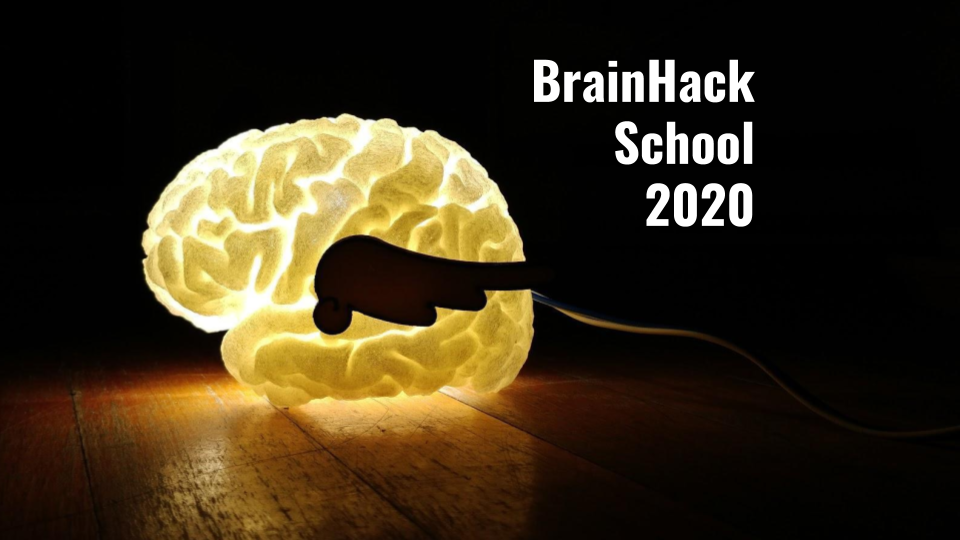

# A template for project reports at BrainHack School

Team contributors: Brainhack School

## Summary 

Each project repository should have a markdown file explaining the background and objectives of the project, as well as a summary of the results, and links to the different deliverables of the project. Project reports are incorporated in the BrainHack School (BHS) [website](https://school.brainhackmtl.org/project). Note that the project summary also involves a number of key words. Those are listed on top of the [GitHub repository](https://github.com/brainhack-school2020/project_template), click `manage topics`.

## Project definition 

### Background

Inspired by the [Recurse Centre](https://www.recurse.com/) initiative (formally known as the "hacker school"), Brainhack School was established in 2018 with the mission to train students from a multidisciplinary background to a panoply of reproducible tools for neural data science, using a project-based approach. Following an initial 3-weeks long pilot, a 4th week was added with an intensive bootcamp, so that students could choose what tools to learn more deeply in their projects. As the course became integrated in standard curriculum at different universities, the formula seemed to be working. In order to streamline the different stages of the project, we needed some standard template and milestones to be incorporated in a github-based workflow. The "project template" project (which is also our first BHS meta-project) aims at establishing such a standardized template.

### Tools 

The "project template" project will rely on the following technologies: 
 * [Markdown](https://guides.github.com/features/mastering-markdown/), to structure the text.
 * The [Hugo website framework](https://gohugo.io) which is used by the BHS website. This makes it possible to easily add the markdown project description to the website. 
 * Adding the project to the website relies on github, through pull requests. 

### Data 

Ultimately, the project template will be used by all BHS participants. Data on the different projects will be aggregareted on the [following page](https://school.brainhackmtl.org/project). This will serve as an additional example gallery in the years to come for future brainhack school students. Many reports from [BHS 2019](https://github.com/mtl-brainhack-school-2019) already used this template. 

### Deliverables

At the end of this project, we will have:
 - The current markdown document, completed and revised.
 - A gallery of the student projects at Brainhack 2020.
 - Instructions on the website about how to submit a pull request to the [BrainHack School website](https://github.com/BrainhackMTL/school) in order to add the project description to the website. 

## Results 

### Progress overview

The project was swiftly initiated by P Bellec, based on the existing template created in 2019 by Tristan Glatard and improved by different students. It was really not that hard. Community feedback is expected to lead to rapid further improvements of this first version. 

### Tools I learned during this project

 * **Meta-project** P Bellec learned how to do a meta project for the first time, which is developping a framework while using it at the same time. It felt really weird, but somehow quite fun as well. 
 * **Github workflow-** The successful use of this template approach will demonstrate that it is possible to incorporate dozens of students presentation on a website collaboratively over a few weeks. 
 * **Project content** Through the project reports generated using the template, it is possible to learn about what exactly the brainhack school students are working on. 
 
### Results 

#### Deliverable 1: report template

You are currently reading the report template! I will let you judge whether it is useful or not. If you think there is something that could be improved, please do not hesitate to open an issue [here](https://github.com/brainhack-school2020/project_template/issues) and let us know. 

#### Deliverable 2: project gallery

There is not yet a project gallery, as BHS 2020 is the first edition that will incorporate it on the website. You can still check out the [2019 BHS github organization](https://github.com/mtl-brainhack-school-2019)

##### ECG pupilometry pipeline by Marce Kauffmann 

The repository of this project can be found [here](https://github.com/mtl-brainhack-school-2019/ecg_pupillometry_pipeline_kaufmann). The objective was to create a processing pipeline for ECG and pupillometry data. The motivation behind this task is that Marcel's lab (MIST Lab @ Polytechnique Montreal) was conducting a Human-Robot-Interaction user study. The repo features:
 * a [video introduction](http://www.youtube.com/watch/8ZVCNeX42_A) to the project.
 * a presentation [made in a jupyter notebook](https://github.com/mtl-brainhack-school-2019/ecg_pupillometry_pipeline_kaufmann/blob/master/BrainHackPresentation.ipynb) on the results of the project.
 * Notebooks for all analyses.
 * Detailed requirements files, making it easy for others to replicate the environment of the notebook.
 * An overview of the results in the markdown document.
 
##### Other projects
Here are other good examples of repositories:
- [Learning to manipulate biosignals with python](https://github.com/mtl-brainhack-school-2019/franclespinas-biosignals) by François Lespinasse
- [Run multivariate anaylysis to relate behavioral and electropyhysiological data](https://github.com/mtl-brainhack-school-2019/PLS_PV_Behaviour) by Mike
- [PET pipeline automation and structural MRI exploration](https://github.com/mtl-brainhack-school-2019/rwickens-sMRI-PET) by Rebekah Wickens
- [Working with PSG [EEG] data from Parkinson's patients](https://github.com/mtl-brainhack-school-2019/Soraya-sleep-data-in-PD-patients) by Cryomatrix
- [Exploring Brain Functional Activation in Adolescents Who Attempted Suicide](https://github.com/mtl-brainhack-school-2019/Anthony-Gifuni-repo) by Anthony Gifuni

#### Deliverable 3: Instructions 
 
 To be made available soon. 
 
 
## Conclusion and acknowledgement

The BHS team hope you will find this template helpful in documenting your project. Developping this template was a group effort, and benefitted from the feedback and ideas of all BHS students over the years.
